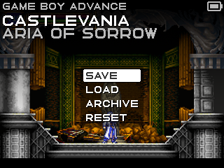
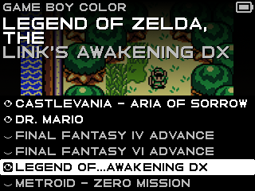
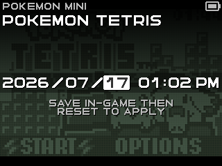
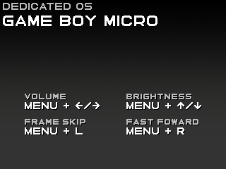

# DEDICATED OS

DEDICATED OS is a cluster of hyper-focused, single-system launchers for specific devices. This version is for playing the Game Boy family of games (plus Pokémon mini) on the Trimui Model S.

This is what it looks like:

  

That's it. You can [grab the latest version here](https://github.com/dedicated-os/dedicated-model-s/releases).

## Features

- no options
- datetime switcher
- single save state
- fast game switcher
- gambatte, gpsp, pokemini for emulation
- fast-forward
- optional frame skip (Game Boy Advance only)
- archive for hiding completed or unstarted games
- auto-save on sleep, when switching games
- auto-sleep in menus

## Powering Off

Before powering off with the physical switch press MENU once to open the menu, then press it again to sleep the device. Once the screen turns off it is safe to flip the physical switch.

## Date & Time

Pressing `SELECT` in the menu brings up the datetime switcher.

 

After changing the datetime you must save in-game then reset from the menu for the game to notice the change. 

Note that the Trimui Model S does not have a real-time clock. The current time is written to a file on every save and reloaded at boot. This guarantees time always progresses forward across boots but cannot keep actual time.

## Shortcuts

 